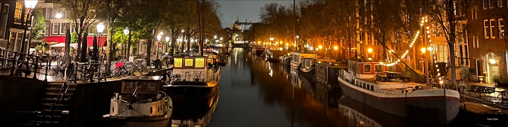

<h1 align="center"><i>Hi, I'm Yunus Emre</i></h1>
<h2 align="center">A web developer from Netherlands</h2>
 

- 🔭 I’m currently working on **JavaScript**

- 👯 I’m looking to collaborate on **HackYourFuture**

- 📫 How to reach me **yebeyaz@gmail.com**

 

<h3 align="left">Languages and Tools:</h3>
 

  
 
 

  
<h3 align="left"></h3>

